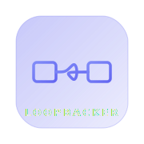
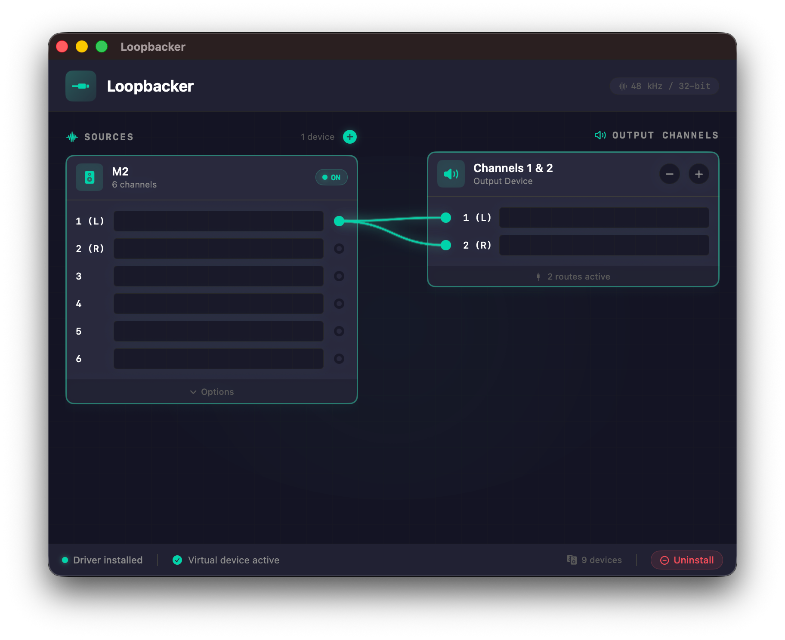

<p align="center">
  <picture>
    <source media="(prefers-color-scheme: dark)" srcset="docs/assets/logo-dark.svg">
    <source media="(prefers-color-scheme: light)" srcset="docs/assets/logo-light.svg">
    
  </picture>
</p>

<h1 align="center">Loopbacker</h1>

<p align="center">
  A virtual audio loopback device for macOS.
</p>

<p align="center">
  <a href="https://github.com/JacobCoffee/loopbacker/actions/workflows/ci.yml"></a>
  <a href="https://github.com/JacobCoffee/loopbacker/releases"></a>
  
  <a href="LICENSE"></a>
</p>

---

<p align="center">
  
</p>

Loopbacker creates a virtual audio device on macOS that routes audio from any app's output directly to an input stream.
Set it as your output device, and anything playing through it becomes available as a mic input -- perfect for capturing
desktop audio in Discord, OBS, or any recording app.

## How it works

```
App A (e.g. Music.app)           App B (e.g. Discord)
       |                                ^
       | output                         | input
       v                                |
   +---+--------------------------------+---+
   |           Lock-free Ring Buffer         |
   +----------------------------------------+
```

A CoreAudio HAL plugin provides the virtual device. A SwiftUI companion app handles driver installation and gives you a
quick overview of the audio routing.

## Install

### From release

Download the latest `.dmg` from [Releases](https://github.com/JacobCoffee/loopbacker/releases), open it, and drag
Loopbacker to Applications.

### From source

Requires Xcode command-line tools and CMake (`brew install cmake`).

```bash
make all          # Build driver + app
make install      # Install driver (sudo) + app to /Applications
```

## Uninstall

```bash
make uninstall    # Remove driver + app
```

## Usage

1. Open **Loopbacker.app** and click **Install Driver** (requires admin).
2. Open **System Settings > Sound** and set the output device to **Loopbacker**.
3. In your recording/chat app, select **Loopbacker** as the input device.
4. Audio played to the Loopbacker output is now captured on its input.

## Project structure

```
loopbacker/
├── Driver/          CoreAudio HAL plugin (C++17, CMake)
├── App/             SwiftUI companion app (Swift 5.9)
├── scripts/         Install/uninstall helpers
└── docs/            Architecture docs
```

## Requirements

- macOS 11+ (Big Sur or later)
- Apple Silicon or Intel (universal binary)
- CMake 3.20+

## License

[FSL-1.1-MIT](LICENSE) -- free to use for any non-competing purpose, converts to MIT after 2 years.
